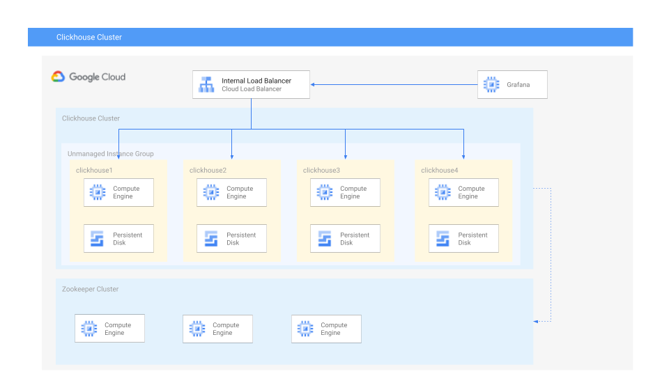

# Clickhouse in Compute Engine

This repository holds the terraform manifest file and necessary script
files to deploy a clickhouse cluster using Compute Engine virtual machines.



## What is deployed

By running the commands above, these resources will be deployed in
your Google Cloud project:

1. Three-node zookeeper cluster
1. Clickhouse cluster, default is 4 nodes
1. Unmanaged instance group containing the clickhouse nodes
1. Internal load-balancer pointing to the clickhouse cluster
1. A vm running Grafana with clickhouse data-source configured


## Quick start

Set the `project_id` variable: in the `terraform` directory, create
a file `terraform.tfvar` with the following as content:

```text
project_id = "your_gcp_project_id"
```

and apply:

```shell-script
cd terraform
terraform init
terraform apply
```

## After deployment

### Create a distributed table

To create an example table `test` on all nodes, login to one of the
clickhouse nodes by using `gcloud compute ssh`, run command

```shell-script
python3 createtable.py | bash
```

The example table `test` is a distributed table with 2 fields(shown as following):

| Field      | Type     |
| id         | Int64    |
| event_time | DateTime |

Run

```shell-script
python3 createtable.py --help
```

to learn how to use this script to create more tables.

### Login to the database

The username is `default` and the password is saved in GCP secret `ch-default-pass-fb6fa0fb3c91`.

On clickhouse nodes, you can run command:

```shell-script
clickhouse-client  --user default --password "$(gcloud secrets versions access --secret=ch-default-pass-fb6fa0fb3c91 latest)"
```

to login to the databse.
